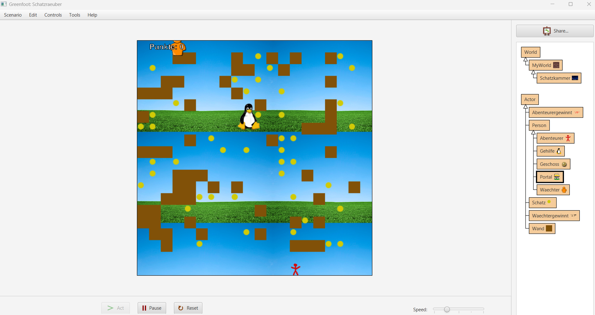
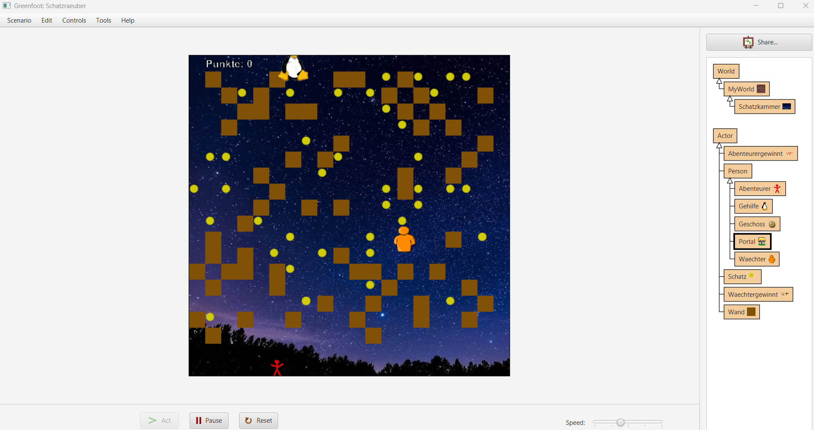

# Schatzraeuber-Greenfoot
2D-Spiel entwickelt mit Java und Greenfoot im Rahmen des Informatikunterrichts.

# Schatzräuber (Java-Spiel)

## Projektbeschreibung

Im Rahmen des Informatikunterrichts habe ich mit **Java und Greenfoot** ein eigenes 2D-Spiel entwickelt. Dabei konnte ich grundlegende Konzepte der objektorientierten Programmierung praktisch anwenden und meine Kenntnisse in der Entwicklung eines vollständigen Spielprojekts vertiefen.

Das Projekt besteht aus verschiedenen Klassen und Objekten, die miteinander interagieren und die Spielwelt sowie die Spielmechanik bilden.

## Technische Umsetzung

Während der Entwicklung habe ich mich unter anderem mit folgenden Bereichen beschäftigt:

- **Java** als Programmiersprache
- **Objektorientierte Programmierung**
- **Klassen und Objekte**
- **Methoden und Programmabläufe**
- **Quellcode und Programmstruktur**
- **UML-Diagramme** zur Darstellung von Klassen und Beziehungen
- Umsetzung und Erweiterung verschiedener **Spielmechaniken**

Dabei ging es nicht nur um die Programmierung einzelner Funktionen, sondern auch darum, die Struktur eines größeren Projekts zu verstehen und verschiedene Komponenten miteinander zu verbinden.

## Was ich dabei gelernt habe

Durch das Projekt konnte ich erste praktische Erfahrungen in der **Softwareentwicklung mit Java** sammeln und mein Verständnis für objektorientierte Programmierung, Klassenstrukturen und die Planung von Softwareprojekten erweitern.

## Screenshots

### Spielszene

## Projekt

Der vollständige Quellcode und die Projektdateien sind in diesem Repository verfügbar.
